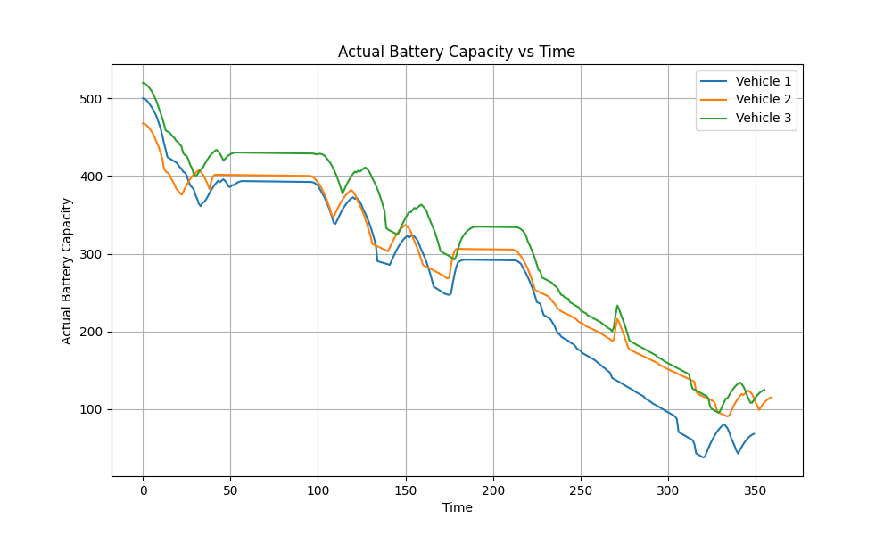

#  Eclipse-DCO Battery Simulation Hack-Challenge
## What was our goal ?
The goal of our project is to provide a tool for OEMs to test their electric vehicles in different weather conditions using SUMO simulator and WeatherAPI to make it easy to input locations for testing. Its important because batteries perform differently in different weather conditions and we simulate and monitor it using SUMO native features and our added functionality

### DCO
Also known as  Developer Console is an active management of the complete software lifecycle tool(development, testing and release)

More info on : https://projects.eclipse.org/projects/automotive.dco/reviews/creation-review

## SUMO (Simulation of Urban MObility)
Simulation of Urban MObility" (SUMO) is an open-source traffic simulation software designed to model and analyze urban mobility. It offers a comprehensive platform for simulating the movement of vehicles, pedestrians, and other road users in realistic urban environments. SUMO enables users, including researchers, urban planners, and developers, to define complex scenarios, incorporating factors such as road networks, traffic lights, and various vehicle types. With its dynamic traffic assignment capabilities, SUMO allows for the simulation of real-time changes in traffic flow, making it a valuable tool for assessing the impact of urban planning decisions on traffic efficiency and congestion.

More info on https://sumo.dlr.de/docs/index.htm

Eclipse Developer Console UI

Eclipse SUMO

Architecture

Output

# Need to know

- Git
- Maven
- Java Spring Boot
- NextJS React

# Hack-Coaches

- Sebastian Lang
- Michail Chatzipanagiotou

# Template Setup

[Getting Started](https://github.com/Eclipse-SDV-Hackathon-Accenture/dco-hack-challenge/blob/main/README_DCO.md)

# All necessary links

- Eclipse SDV Developer Console: https://gitlab.eclipse.org/eclipse/dco/developer-console
- Eclipse SUMO: https://github.com/eclipse-sumo/sumo
